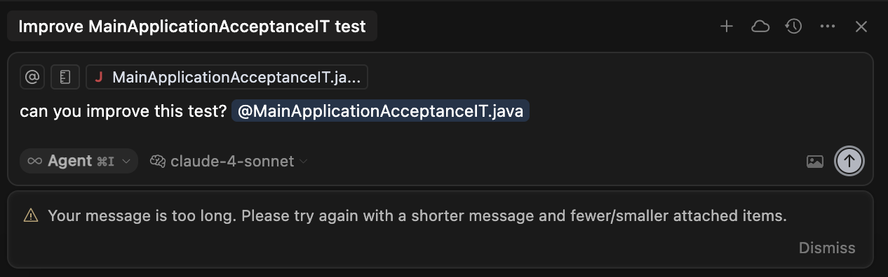
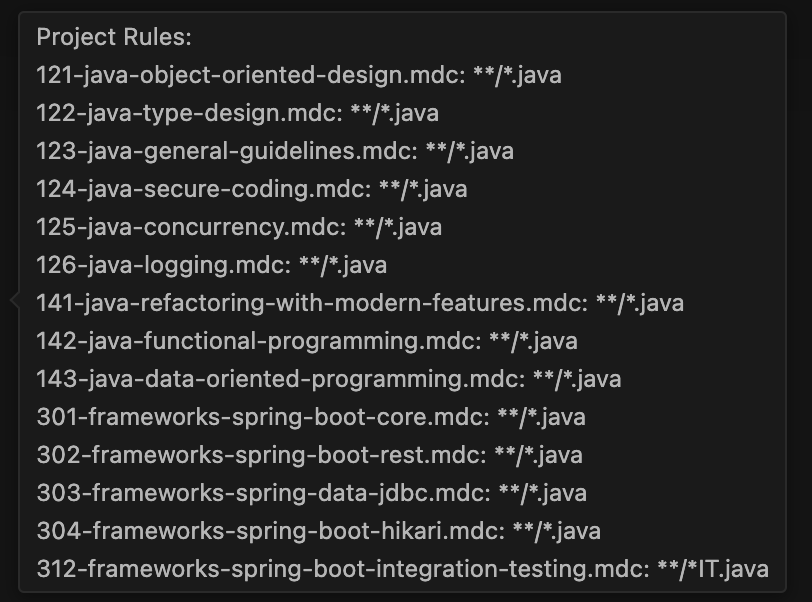
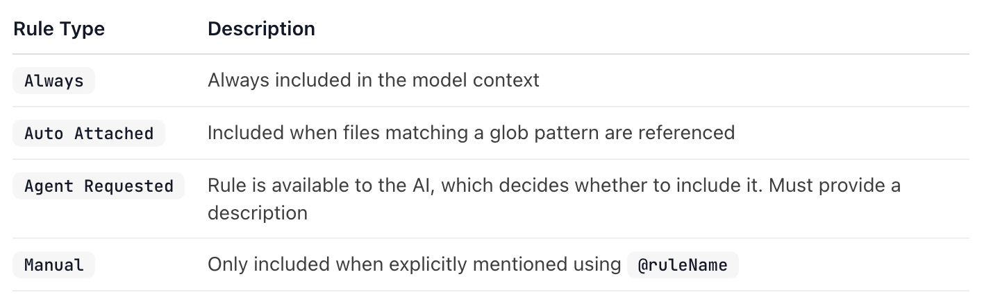
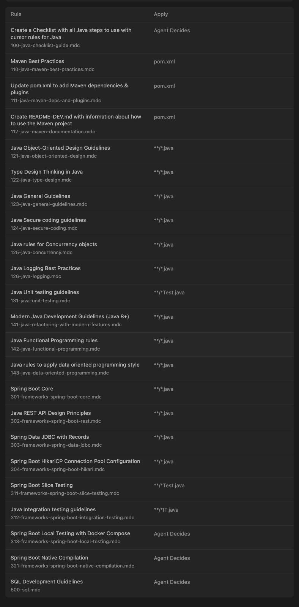
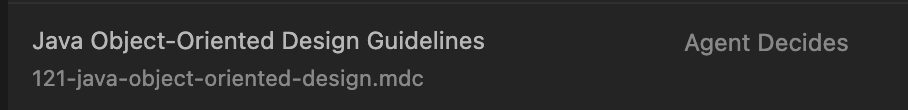

# Your message is too long. Please try again with a shorter message and fewer/smaller attached items

## Description

When you open a new Chat window and the repository has enabled several cursor rules affected the same file, it is not possible to operate with Cursor.

**Prompt:**

```bash
Can you improve this test? MainApplicationAcceptanceIT
```



**Response:**

```bash
Your message is too long. 
Please try again with a shorter message and fewer/smaller attached items.
```

## Analysis

The Java class is a target to be affected by 14 cursor rules;



with a total weight around 100k

A cursor rule can have the following scopes:



Source: https://docs.cursor.com/context/rules

Every cursor rules (.mdc) begin with the following syntax:

```bash
---
description: Java Object-Oriented Design Guidelines
globs: **/*.java
alwaysApply: false
---
```

Reviewing all cursor rules:



All cursor rule are configured. 
In this set of cursor rules, the way to indicate Cursor that a cursor rule need to be added manually in the context is:

```bash
---
description: Java Object-Oriented Design Guidelines
globs: 
alwaysApply: false
---
```



But how to put the cursor rule in a manual way?

```bash
---
description: 
globs: 
alwaysApply: false
---
```


In order to minimize the context weight, it is necessary to put the scope as manual, but the UX is not clear, I have the impression that the structure require a new property to define explicitely the scope:

```bash
---
description: Java Object-Oriented Design Guidelines
globs: 
alwaysApply: false #To be deprecated 
scope: always | auto | agent-requested | manual
---
```

A new property in the metadata section for cursor rules could help to be more consistent the UX with the cursor rule documents (.mdc)

## Details

```bash
https://gitingest.com/
https://github.com/jabrena/cursor-rules-java
Filters: "docs, examples, README.md, CHANGELOG.md, LICENSE, .github"

Directory structure:
└── jabrena-cursor-rules-java/
    └── .cursor/
        └── rules/
            ├── 100-java-checklist-guide.mdc
            ├── 110-java-maven-best-practices.mdc
            ├── 111-java-maven-deps-and-plugins.mdc
            ├── 112-java-maven-documentation.mdc
            ├── 121-java-object-oriented-design.mdc
            ├── 122-java-type-design.mdc
            ├── 123-java-general-guidelines.mdc
            ├── 124-java-secure-coding.mdc
            ├── 125-java-concurrency.mdc
            ├── 126-java-logging.mdc
            ├── 131-java-unit-testing.mdc
            ├── 141-java-refactoring-with-modern-features.mdc
            ├── 142-java-functional-programming.mdc
            ├── 143-java-data-oriented-programming.mdc
            └── templates/
                ├── java-checklist-template.md
                ├── java-maven-deps-template.md
                ├── java-maven-plugins-template.md
                ├── java-maven-properties-template.md
                └── java-maven-questions-template.md
```

- Repository: jabrena/cursor-rules-java
- Files analyzed: 19
- Estimated tokens: 96.7k

---

```bash
https://gitingest.com/
https://github.com/jabrena/cursor-rules-spring-boot
Filters: docs, example, README.md, CHANGELOG.md, LICENSE, .github

Directory structure:
└── jabrena-cursor-rules-spring-boot/
    └── .cursor/
        └── rules/
            ├── 301-frameworks-spring-boot-core.mdc
            ├── 302-frameworks-spring-boot-rest.mdc
            ├── 303-frameworks-spring-data-jdbc.mdc
            ├── 304-frameworks-spring-boot-hikari.mdc
            ├── 311-frameworks-spring-boot-slice-testing.mdc
            ├── 312-frameworks-spring-boot-integration-testing.mdc
            ├── 313-frameworks-spring-boot-local-testing.mdc
            ├── 321-frameworks-spring-boot-native-compilation.mdc
            └── 500-sql.mdc
```

- Repository: jabrena/cursor-rules-spring-boot
- Files analyzed: 9
- Estimated tokens: 38.7k

## How to reproduce

```bash
sdk install jbang
# Add cursor rules for Java & Spring Boot in ./cursor/rules
jbang --fresh setup@jabrena init --cursor https://github.com/jabrena/cursor-rules-java
jbang --fresh setup@jabrena init --cursor https://github.com/jabrena/cursor-rules-spring-boot
```
